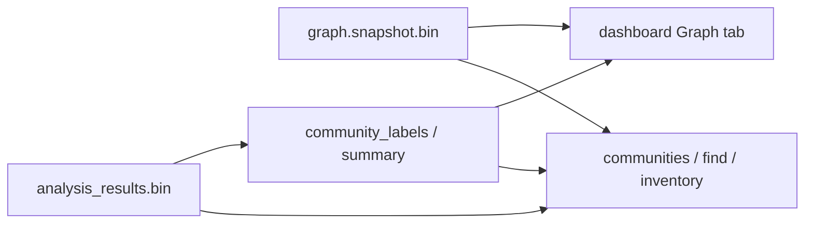

# Community query & naming — Implementation plan

**Goal:** Make label-propagation communities **queryable** and **human-named** (Graphify-style sidebar UX) without writing community labels or membership edges into the topology graph.

**Non-goals (this plan):** Leiden algorithm; stamping `community_id` / `MEMBER_OF` into `graph.snapshot.bin`; requiring an LLM for v1.

**Related:** [graph-metrics-design.md](graph-metrics-design.md) (community detection naming), [structured-query guide](../guides/structured-query.md), [semantic-search-design.md](semantic-search-design.md), [analysis-architecture.md](../analysis-architecture.md).

---

## 1. Why this shape

| Concern | Choice |
|---------|--------|
| Code graph = facts | Topology stays CALLS/USES/… only |
| Communities = derived partition | Live in `analysis_results.bin` + dashboard JSON |
| Naming = metadata on the partition | `community_id → label` sidecar / summary rows |
| Semantic / embedding community ID | Later: pool member embeddings; still not topology |

UX target (Graphify hero): colored clusters + sidebar of **named** communities with sizes — not `Community 450`.



---

## 2. Phased delivery

| Phase | Outcome | User-visible |
|-------|---------|--------------|
| **P0** | Wire existing heuristic labels into export | Dashboard shows real names, not `Community N` |
| **P1** | `communities list` + `inventory --by community` | Agents/CLI can list communities and scoped `find` |
| **P2** | Macros + docs/recipes | One-liner discoverability |
| **P3** | Optional embedding-assisted / LLM naming | Graphify-quality thematic labels |
| **P4** | Community semantic search (optional) | “Find communities like checkout” |

Ship P0→P2 before investing in LLM naming.

---

## 3. Phase 0 — Named communities in the dashboard (quick UX win)

### Problem
`detect_communities` / `build_dashboard_community` already infer labels (path prefix, token frequency, `"Infrastructure / Common Library"`), but `rgctl_dashboard::communities::summarize_communities` hardcodes `format!("Community {cid}")`.

### Steps

1. **Single label builder** — Extract shared API in `rgctl-analysis` (or dashboard helper that calls analysis):
   - Input: community id, member node refs (or names + paths), optional infra flag
   - Output: `label: String`
   - Reuse `infer_label_from_names`, path-prefix logic from `community.rs`
2. **Persist labels with analysis (preferred)** — Extend community sidecar so discover does not recompute labels only at dashboard time:
   - Option A (minimal): add `CommunityLabelTable { labels: Vec<(usize, String)> }` or `HashMap<usize, String>` next to `CommunityTable` in `AnalysisResults`
   - Option B (lighter): compute labels only during dashboard export from graph + assignments (no schema bump) — acceptable for P0 if discover already hydrates for `--with-dashboard`
3. **Fix export** — In `crates/rgctl-dashboard/src/communities.rs`, set `CommunitySummary.label` from the label builder / analysis, not `Community {id}`.
4. **UI check** — Graph tab community legend / filters show the new strings; colors unchanged (`community_color_hex`).
5. **Tests** — Unit test: two clusters with `login`/`logout` vs `get_user`/`list_users` → distinct non-placeholder labels; infra hub → `"Infrastructure / Common Library"`.
6. **Docs** — Note in [dashboard-user-guide.md](https://github.com/sshaaf/rgctl/blob/a7f875d4e2e2f6c183c6cb8a946675f889dc5383/dashboard-user-guide.md) that community names are heuristic.

### Acceptance
- After `discover … --with-dashboard`, `.rgctl/dashboard/communities.json` has meaningful `label` values for ≥ majority of communities with size ≥ 2 on ecommerce-java (or fixture).
- Fallback remains `Community {id}` when inference is weak.

---

## 4. Phase 1 — Agent-facing community queries (shipped)

### Design rules
- Do **not** mutate `graph.snapshot.bin`.
- Community assignments live in `analysis_results.bin`; labels surface via `communities list` and `inventory --by community`.
- Membership exploration uses **scoped `find`** (package prefix from heuristic label) — not topology `MEMBER_OF` edges.

### Steps (implemented)

1. **`communities list` / `label --write`** — JSON with `id`, `label`, `member_count`.
2. **`inventory --by community`** — bucket sizes per community id.
3. **Scoped `find`** — `--scope` on qualified-name prefix derived from the community label.
4. **Tests** — dashboard export labels; CLI `communities` JSON; ecommerce-java fixture asserts non-placeholder labels.
5. **Perf** — listing communities is O(#communities); inventories mmap the snapshot once per command.

### Acceptance
```bash
rgctl -r "$REPO" -f json communities list | jq '.communities[:10]'
rgctl -r "$REPO" -f json find --type function --scope com.example.pkg --limit 20
```
Both work after normal `discover` (analysis present). Snapshot size / content digest unchanged when only community labels change.

---

## 5. Phase 2 — Agent docs

### Steps

1. **Docs**
   - [structured-query.md](../guides/structured-query.md) + [user-guide.md](../user-guide.md) §6: `communities list`, `inventory --by community`, scoped `find`
   - [HTTP Server and Dashboard](../guides/http-server-and-dashboard.md): dashboard + semantic HTTP; structural queries stay on CLI
2. **Skills** — the `rgctl` skill calls `communities` / `find`, not graph pattern languages.

### Acceptance
Agent recipe copy-paste works on ecommerce-java; JSON schema_version stable.

---

## 6. Phase 3 — Better naming (Graphify-quality)

Layer on P0 heuristics; keep labels in the community summary sidecar.

| Tier | Method | When |
|------|--------|------|
| **3a Heuristic v2** | Package-majority vote, top PageRank symbol in cluster, strip infra hubs from naming | Default discover |
| **3b Embedding-assisted** | Mean/pool member vectors from `semantic_index.bin`; pick representative token or nearest lexicon phrase | After `semantic index` |
| **3c LLM / agent label** | Opt-in `rgctl communities label` (or discover flag) with member sample → short title | CI/offline; never required for core |

### Steps (3a first)

1. Improve label builder inputs: package paths from metagraph, centrality from analysis.
2. Deduplicate colliding labels (`auth`, `auth (2)`).
3. Persist labels; dashboard + `communities list` both read same source.
4. (3b) Optional: write `community_embedding` rows keyed by id; do not block P1.
5. (3c) CLI subcommand mirroring Graphify’s `label` / `--no-label` split — agent can rename; CLI can call a backend later.

### Acceptance
On a mid-size app repo, sidebar names are mostly domain words; placeholders &lt; ~20% of communities with size ≥ 5.

---

## 7. Phase 4 — Community-level semantic search (optional)

Only after P1 + semantic index maturity.

1. Build community vectors (pool function embeddings of members).
2. `semantic query --scope community "shopping cart"`.
3. Still no topology mutation.

---

## 8. Implementation map (files)

| Area | Likely touch points |
|------|---------------------|
| Label inference | `crates/rgctl-analysis/src/community.rs` |
| Analysis schema | `crates/rgctl-analysis/src/results.rs` (+ migrate/version if new columns) |
| Dashboard export | `crates/rgctl-dashboard/src/communities.rs`, export bundle entry |
| Discover write path | `src/cli/discover_impl.rs` (fill labels when community table written) |
| Structured query | `crates/rgctl-graph/src/structured_query.rs`, `src/cli/structured_query.rs` |
| Communities CLI | `src/cli/communities.rs` |
| Docs | `docs/guides/structured-query.md`, `AGENTS.md`, user-guide |
| Tests | analysis unit tests; `communities` JSON; dashboard harness community label assert |

---

## 9. Suggested work order (checklist)

### P0 — Dashboard names
- [x] Shared `infer_community_label(...)` API
- [x] Wire into `summarize_communities` / export
- [x] Fixture test + manual check on ecommerce-java
- [x] Dashboard user-guide blurb

### P1 — Structured community queries
- [x] `communities list` + `inventory --by community`
- [x] Scoped `find` recipes in user guide
- [x] Missing-analysis behavior
- [x] Integration tests

### P2 — Discoverability
- [x] [structured-query.md](../guides/structured-query.md) + agent skills
- [x] AGENTS + http-api updates

### P3 — Naming quality
- [x] Heuristic v2 (package / hub-aware)
- [x] Label collision handling
- [x] (Optional) embedding-assisted names — via `--scope community` pooling
- [x] (Optional) `communities label` CLI

### P4 — Community search
- [x] Community embedding index + query flag (`semantic query --scope community`)

---

## 10. Risks & decisions

| Risk | Mitigation |
|------|------------|
| Users expect `MEMBER_OF` edges | Document virtual model; offer WHERE form first |
| Label churn every discover | Accept for heuristics; stable id + mutable label; don’t bust graph digest |
| Analysis/graph skew after partial incremental | If assignments missing, omit property; document “re-run discover” |
| `:Community` vs real `NodeType` | Keep virtual; never write Community nodes to snapshot |
| LLM cost/privacy | P3c opt-in only |

**Decision locked by this plan:** communities stay **outside** the topology graph; naming and query are **overlays**.

---

## 11. Success metrics (UX)

- Users can answer “what are the subsystems?” via dashboard legend **or** `communities list` / scoped `find`.
- Names read as domain language more often than `Community N`.
- Discover wall time / snapshot size unchanged for P0–P2 (no second graph rewrite).
- Agents use recipes without opening `communities.json` by hand.
